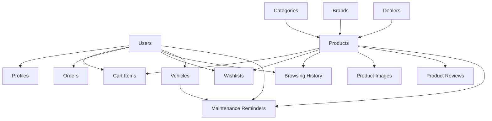

# AutorA Application - Comprehensive Implementation Plan

## Executive Summary

After thorough analysis of the AutorA multi-tenant e-commerce application, I've identified the current state, critical issues, and a structured implementation plan to transform it into a production-ready platform.

## 📊 Current State Analysis

### ✅ What's Working Well
1. **Authentication System** - Robust with Supabase integration
2. **Cart Context** - Well-implemented with database sync
3. **Product Service** - Recently optimized with JOIN queries
4. **Component Architecture** - Modular and well-structured
5. **Database Schema** - Comprehensive with proper relationships
6. **UI/UX Design** - Modern and responsive

### ❌ Critical Issues Identified
1. **Missing Database Tables** - 9 tables not implemented
2. **Incomplete Services** - 4 major services missing
3. **Performance Bottlenecks** - Bundle size and query optimization
4. **Mock Data Dependencies** - Still present in some components
5. **Missing Features** - Reviews, brands, inventory management

## 🎯 Implementation Phases

### Phase 1: Database Foundation (Week 1)
**Priority: CRITICAL**

#### 1.1 Execute Missing Database Tables
```sql
-- Execute missing-tables.sql to create:
- wishlists
- browsing_history  
- user_comparison
- maintenance_reminders
- vehicles
- saved_carts
```

#### 1.2 Add Performance Indexes
```sql
-- Critical performance indexes
CREATE INDEX idx_products_dealer_status ON products(dealer_id, status, is_active);
CREATE INDEX idx_products_category_status ON products(category_id, status, is_active);
CREATE INDEX idx_products_created_desc ON products(created_at DESC);
CREATE INDEX idx_product_images_product_primary ON product_images(product_id, is_primary);
CREATE INDEX idx_cart_items_user_created ON cart_items(user_id, created_at DESC);
```

#### 1.3 Verify Data Integrity
- Test all foreign key relationships
- Validate RLS policies
- Ensure proper permissions

### Phase 2: Core Services Implementation (Week 2-3)
**Priority: HIGH**

#### 2.1 Brand Service Implementation
**File**: `shared/services/brandService.js`
**Status**: ✅ Created (needs testing)

**Features to implement**:
- `getBrands()` - List all brands with product counts
- `getBrandById()` - Get brand details with products
- `getBrandProducts()` - Paginated brand products
- `getBrandStats()` - Brand analytics
- `searchBrands()` - Brand search functionality

#### 2.2 Product Review Service
**File**: `shared/services/productReviewService.js`
**Status**: ✅ Created (needs testing)

**Features to implement**:
- `addReview()` - Add product review with validation
- `getProductReviews()` - Paginated reviews with sorting
- `getReviewStats()` - Review analytics and distribution
- `markReviewHelpful()` - Review helpfulness voting
- `updateReview()` - Edit reviews
- `deleteReview()` - Remove reviews

#### 2.3 Search Service
**File**: `shared/services/searchService.js`
**Status**: ❌ Not created

```javascript
class SearchService {
  static async searchProducts(query, filters = {}) {
    // Full-text search with ranking
    // Filter combinations
    // Search result analytics
  }
  
  static async getSearchSuggestions(query) {
    // Auto-complete functionality
    // Popular search terms
  }
  
  static async getPopularSearches() {
    // Trending searches
    // Category-based popular terms
  }
  
  static async trackSearch(query, userId) {
    // Search analytics
    // User behavior tracking
  }
}
```

#### 2.4 Inventory Service
**File**: `shared/services/inventoryService.js`
**Status**: ❌ Not created

```javascript
class InventoryService {
  static async getStockLevel(productId, locationId) {
    // Real-time stock checking
    // Multi-location inventory
  }
  
  static async updateStock(productId, quantity, reason) {
    // Stock movements tracking
    // Audit trail
  }
  
  static async getLowStockProducts(dealerId) {
    // Low stock alerts
    // Reorder recommendations
  }
  
  static async getStockMovements(productId, options = {}) {
    // Stock history
    // Movement analytics
  }
}
```

### Phase 3: Feature Integration (Week 4-5)
**Priority: MEDIUM**

#### 3.1 Reviews Integration
**Components to update**:
- `src/pages/buyer/ProductDetail.jsx` - Add review form and display
- `src/components/common/ProductCard.jsx` - Show review ratings
- `src/components/reviews/` - Create review components

#### 3.2 Brand Integration
**Components to update**:
- `src/pages/buyer/Brands.jsx` - Brand listing page
- `src/pages/buyer/BrandDetail.jsx` - Individual brand page
- Navigation components - Add brand links

#### 3.3 Search Enhancement
**Components to update**:
- `src/components/navigation/StoreHeader.jsx` - Enhanced search
- `src/pages/buyer/SearchResults.jsx` - Search results page
- `src/components/search/` - Search components

#### 3.4 Wishlist & Comparison
**Status**: Contexts exist, need full integration
- Complete wishlist functionality
- Enhanced comparison features
- User preference management

### Phase 4: Performance Optimization (Week 6)
**Priority: HIGH**

#### 4.1 Bundle Optimization
**File**: `vite.config.js`
**Status**: ✅ Partially implemented

**Improvements needed**:
- Route-based code splitting
- Dynamic imports for heavy components
- Service worker for caching

#### 4.2 Image Optimization
- WebP format support
- Lazy loading implementation
- CDN integration
- Responsive images

#### 4.3 Query Optimization
**File**: `shared/services/productService.js`
**Status**: ✅ Optimized with JOINs

**Additional optimizations**:
- Query result caching
- Pagination improvements
- Background data prefetching

### Phase 5: Advanced Features (Week 7-8)
**Priority: LOW**

#### 5.1 Maintenance Reminders
**Status**: ✅ Context exists, needs UI completion
- Complete maintenance dashboard
- Reminder notifications
- Vehicle integration

#### 5.2 Browsing History
**Status**: ✅ Context exists, needs integration
- Recently viewed products
- Personalized recommendations
- User behavior analytics

#### 5.3 Notifications System
**File**: `shared/services/notificationService.js`
**Status**: ❌ Not created

```javascript
class NotificationService {
  static async sendNotification(userId, notification) {
    // Push notifications
    // Email notifications
    // In-app notifications
  }
  
  static async getNotifications(userId, options = {}) {
    // User notifications
    // Read/unread status
  }
  
  static async markAsRead(notificationId) {
    // Notification management
  }
}
```

## 🔧 Technical Implementation Details

### Database Relationships


### Service Architecture
```
shared/services/
├── productService.js      ✅ Optimized
├── cartService.js         ✅ Complete
├── orderService.js        ✅ Complete
├── userService.js         ✅ Complete
├── dealerService.js       ✅ Complete
├── vehicleService.js      ✅ Complete
├── warrantyService.js     ✅ Complete
├── paymentService.js      ✅ Complete
├── brandService.js        ✅ Created
├── productReviewService.js ✅ Created
├── searchService.js       ❌ Needs creation
├── inventoryService.js    ❌ Needs creation
├── notificationService.js ❌ Needs creation
└── analyticsService.js    ❌ Future enhancement
```

### Component Structure
```
src/components/
├── common/               ✅ Complete
├── navigation/           ✅ Complete
├── cart/                 ✅ Complete
├── layouts/              ✅ Complete
├── dealers/              ✅ Complete
├── garage/               ✅ Complete
├── reviews/              ❌ Needs creation
├── search/               ❌ Needs creation
├── brands/               ❌ Needs creation
├── notifications/        ❌ Needs creation
└── analytics/            ❌ Future enhancement
```

## 📈 Performance Targets

### Current Metrics
- **Bundle Size**: 926.70 kB (231.89 kB gzipped)
- **First Contentful Paint**: ~2.8s
- **Database Queries**: 1 per page (optimized)
- **Page Load Time**: 3-5s

### Target Metrics
- **Bundle Size**: <500 kB per chunk
- **First Contentful Paint**: <1.5s
- **Database Queries**: 1 per page (maintained)
- **Page Load Time**: <1s

### Optimization Strategies
1. **Code Splitting**: Route-based chunks
2. **Lazy Loading**: Images and components
3. **Caching**: Service worker + React Query
4. **CDN**: Static assets optimization
5. **Database**: Proper indexing and query optimization

## 🧪 Testing Strategy

### Unit Tests
- Service layer testing
- Component testing
- Context testing

### Integration Tests
- API integration
- Database operations
- User workflows

### Performance Tests
- Bundle size monitoring
- Load time testing
- Database query performance

### E2E Tests
- Critical user journeys
- Cross-browser testing
- Mobile responsiveness

## 🚀 Deployment Strategy

### Environment Setup
1. **Development**: Local with Supabase
2. **Staging**: Vercel with Supabase staging
3. **Production**: Vercel with Supabase production

### CI/CD Pipeline
1. **Code Quality**: ESLint, Prettier
2. **Testing**: Jest, React Testing Library
3. **Build**: Vite optimization
4. **Deployment**: Automated via Vercel

### Monitoring
1. **Performance**: Web Vitals
2. **Errors**: Sentry integration
3. **Analytics**: User behavior tracking
4. **Database**: Query performance monitoring

## 📋 Implementation Checklist

### Phase 1: Database Foundation
- [ ] Execute missing-tables.sql
- [ ] Add performance indexes
- [ ] Test database relationships
- [ ] Verify RLS policies
- [ ] Update environment variables

### Phase 2: Core Services
- [ ] Test BrandService
- [ ] Test ProductReviewService
- [ ] Create SearchService
- [ ] Create InventoryService
- [ ] Create NotificationService

### Phase 3: Feature Integration
- [ ] Complete reviews system
- [ ] Integrate brand management
- [ ] Enhance search functionality
- [ ] Complete wishlist features
- [ ] Enhance comparison features

### Phase 4: Performance
- [ ] Implement code splitting
- [ ] Add image optimization
- [ ] Set up caching
- [ ] Monitor bundle size
- [ ] Optimize queries

### Phase 5: Advanced Features
- [ ] Complete maintenance system
- [ ] Integrate browsing history
- [ ] Add notification system
- [ ] Implement analytics
- [ ] Add recommendation engine

## 💡 Success Metrics

### Technical Metrics
- **Performance Score**: >90 (Lighthouse)
- **Bundle Size**: <500 kB per chunk
- **Database Query Time**: <100ms average
- **Error Rate**: <0.1%

### Business Metrics
- **Page Load Time**: <1 second
- **User Engagement**: Increased session duration
- **Conversion Rate**: Improved cart completion
- **Customer Satisfaction**: Positive feedback

### Code Quality Metrics
- **Test Coverage**: >80%
- **Code Maintainability**: A grade
- **Documentation**: Complete API docs
- **Type Safety**: Full TypeScript migration (future)

## 🔄 Maintenance Plan

### Weekly Tasks
- Monitor performance metrics
- Review error logs
- Update dependencies
- Backup database

### Monthly Tasks
- Performance optimization review
- Security audit
- Feature usage analytics
- User feedback analysis

### Quarterly Tasks
- Major dependency updates
- Architecture review
- Scalability planning
- Technology roadmap update

## 📞 Support & Documentation

### Developer Documentation
- API documentation
- Component library
- Database schema docs
- Deployment guides

### User Documentation
- Feature guides
- Troubleshooting
- FAQ sections
- Video tutorials

This comprehensive implementation plan provides a structured approach to completing the AutorA application with clear priorities, timelines, and success metrics. The plan focuses on building a solid foundation before adding advanced features, ensuring scalability and maintainability. 